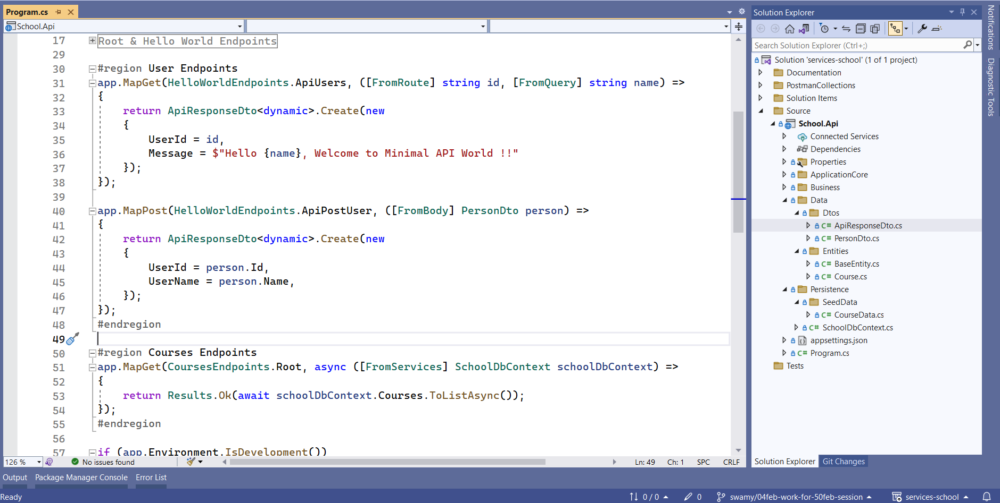
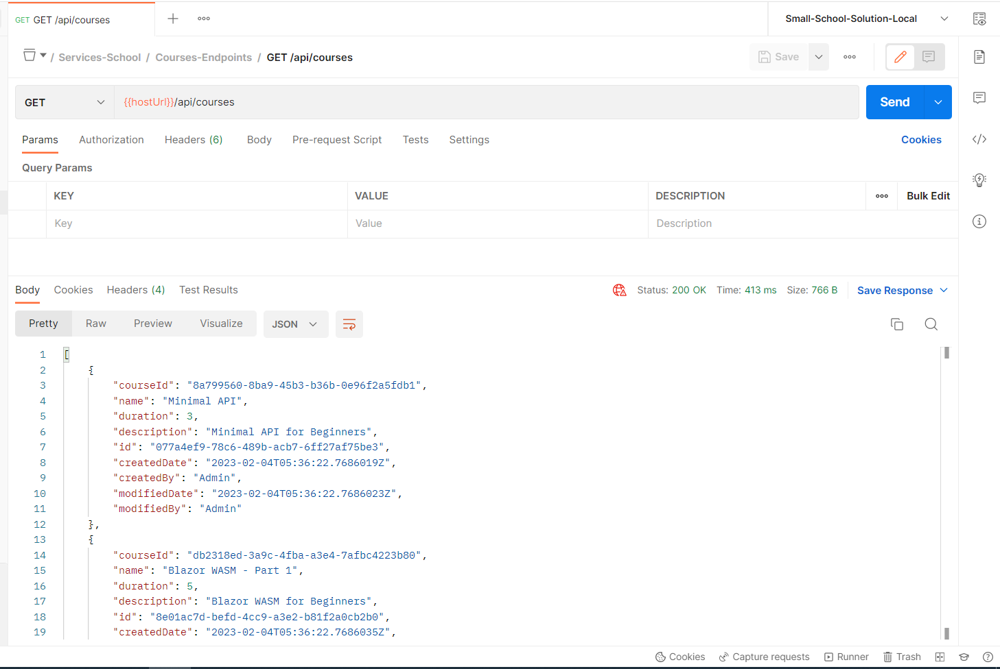

# .NET 7 - Minimal API with Model Binding, Entity, DI, EF Core, and Seed Data

## Date Time: 08-Mar-2023 at 08:30 PM IST

---

### Software/Tools

> 1. OS: Windows 10 x64
> 1. .NET 7
> 1. Visual Studio 2022
> 1. Visual Studio Code
> 1. Postman

### Prior Knowledge

> 1. Programming knowledge in C#

## Technology Stack

> 1. .NET 7, Azure

## Information


## What are we doing today?

> 1. Tour of .NET 7 Minimal API Project (Web API, and Web App Empty Template)
> 1. Dependency Injection, and Comparision of Service Collections
>    - Web App Empty
>    - Web API with Uncheck Controllers
>    - Web API with Controllers
> 1. Comparison of HTTP Request Pipeline
> 1. Parameter Binding demo with User Endpoints
>    - From Query | From Route | From Body | From Services
> 1. Base Entity
> 1. Course Entity inheriting Base Entity
> 1. Just enough `Entity Framework` Core (In Memory)
> 1. Dependency Injection of DbContext
> 1. GetAllCourses() API Endpoint
> 1. Seed Data
> 1. Update Postman Collections to test the API (Environment Variables, and Collections)

### Please refer to the [**Source Code**](https://github.com/Microservices-for-Small-Computer-School/Services-Courses) of today's session for more details

---


---

## 1. Tour of .NET 7 Minimal API Project (Web API, and Web App Empty Template)

> 1. Discussion and Demo

## 2. Dependency Injection, and Comparision of Service Collections

> 1. Discussion and Demo

### Web App Empty |  Web API with Uncheck Controllers |  Web API with Controllers

> 1. Discussion and Demo

## 3. Comparison of HTTP Request Pipeline

> 1. Discussion and Demo

**References:**

> 1. [https://learn.microsoft.com/en-us/aspnet/core/fundamentals/middleware/?view=aspnetcore-7.0](https://learn.microsoft.com/en-us/aspnet/core/fundamentals/middleware/?view=aspnetcore-7.0)
> 1. [https://learn.microsoft.com/en-us/aspnet/core/fundamentals/middleware/write?view=aspnetcore-7.0](https://learn.microsoft.com/en-us/aspnet/core/fundamentals/middleware/write?view=aspnetcore-7.0)

## 4. Parameter Binding demo with User Endpoints

> 1. Discussion and Demo
> 1. Update the Constants.cs file for User Endpoints
> 1. Create a PersonDto.cs file

```csharp
public static class UsersRoutes
{
    public static string Root => "/api/users";
    
    public static string ActionById => "/api/users/{id}";
}
```

```csharp
public record PersonDto(string? Id, string? Name);
```

**References:**

> 1. [https://learn.microsoft.com/en-us/aspnet/core/fundamentals/minimal-apis/parameter-binding?view=aspnetcore-7.0](https://learn.microsoft.com/en-us/aspnet/core/fundamentals/minimal-apis/parameter-binding?view=aspnetcore-7.0)

### From Query | From Route | From Body | From Services

> 1. Discussion and Demo
> 1. Add User Endpoints in Program.cs

```csharp
app.MapGet(UsersRoutes.ActionById, ([FromRoute] string id, [FromQuery] string name) =>
{
    return ApiResponseDto<dynamic>.Create(new
    {
        UserId = id,
        Message = $"Hello {name}, Welcome to Minimal API World !!"
    });
});

app.MapPost(UsersRoutes.Root, ([FromBody] PersonDto person) =>
{
    return ApiResponseDto<dynamic>.Create(new
    {
        UserId = person.Id,
        UserName = person.Name,
    });
});
```



## 5. Base Entity

> 1. Discussion and Demo

```csharp
public class BaseEntity
{
    [Key]
    public Guid Id { get; set; }

    [Required]
    public DateTime CreatedDate { get; set; }
    
    [Required]
    public string? CreatedBy { get; set; }
    
    [Required]
    public DateTime ModifiedDate { get; set; }
    
    [Required]
    public string? ModifiedBy { get; set; }
}
```

## 6. Course Entity inheriting Base Entity

> 1. Discussion and Demo

```csharp
public class Course : BaseEntity
{
    public string? CourseId { get; set; }

    public string? Name { get; set; }
    
    public int Duration { get; set; }
    
    public string? Description { get; set; }
}
```

## 7. Just enough `Entity Framework` Core (In Memory)

> 1. Discussion and Demo

```xml
<ItemGroup>
    <PackageReference Include="Microsoft.EntityFrameworkCore" Version="7.0.2" />
    <PackageReference Include="Microsoft.EntityFrameworkCore.InMemory" Version="7.0.2" />
</ItemGroup>
```

```csharp
public class SchoolDbContext : DbContext
{
    public SchoolDbContext(DbContextOptions<SchoolDbContext> options) : base(options)
    {
    }

    public DbSet<Course> Courses => Set<Course>();

    protected override void OnModelCreating(ModelBuilder builder)
    {
        base.OnModelCreating(builder);

        builder.ApplyConfiguration(new CourseData());
    }
}
```

## 8. Dependency Injection of DbContext

> 1. Discussion and Demo
> 1. Update the Constants.cs file for Course Endpoints
> 1. Add DbContext as Dependency in Program.cs

```csharp
public static class InMemoryDatabase
{
    public static string Name { get; } = "SchoolDatabase";
}
```

```csharp
_ = builder.Services.AddDbContext<SchoolDbContext>(options =>
                options.UseInMemoryDatabase(InMemoryDatabase.Name));
```

## 10. GetAllCourses() API Endpoint

> 1. Discussion and Demo
> 1. Update the Constants.cs file for Course Endpoints

```csharp
public static class CoursesRoutes
{
    public static string Root { get; } = "/api/courses";
}
```

```csharp
app.MapGet(CoursesRoutes.Root, async ([FromServices] SchoolDbContext schoolDbContext) =>
{
    return Results.Ok(await schoolDbContext.GetAllCourses());
});
```



## 10. Seed Data

> 1. Discussion and Demo

## 11. Update Postman Collections to test the API (Environment Variables, and Collections)

> 1. Discussion and Demo


---

## SUMMARY / RECAP / Q&A

> 1. SUMMARY / RECAP / Q&A
> 2. Any open queries, I will get back through meetup chat/twitter.

---

## What is Next? session `3` of `5` Sessions on 09 Mar, 2023

> 1. Create responses in Minimal API
> 1. Dependency Injection and Inversion of Control - Deep Dive
> 1. Enhancing GetAllCourses() API Endpoint to return Unified Response
> 1. Move the Hello World Endpoints into an Extension Class
> 1. Move the User Endpoints into an Extension Class
> 1. Move the Course Endpoints into an Extension Class
> 1. Creating Course Dtos using record
> 1. Auto Mapper Configuration
> 1. Dependency Injection of Auto Mapper
> 1. Enhancing GetAllCourses() API Endpoint to return Course Dtos
> 1. Update Postman Collections to test the API (Environment Variables, and Collections)
